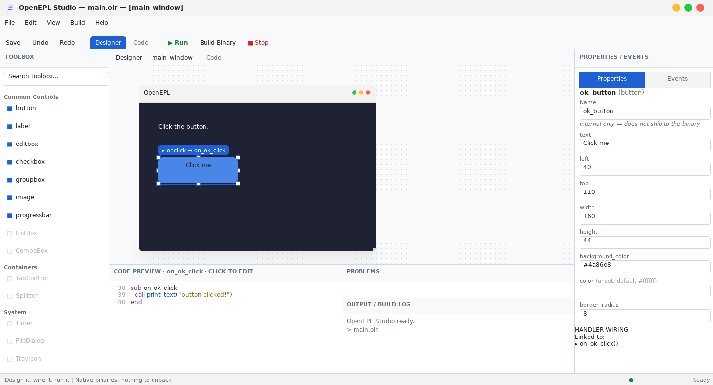
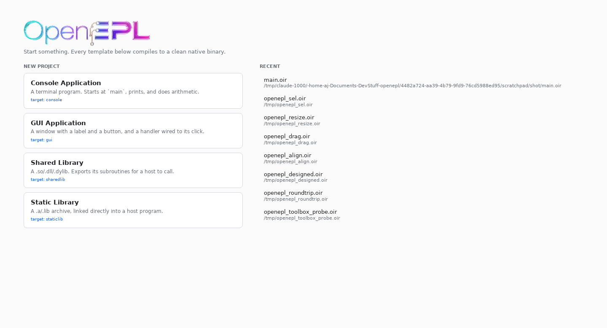

<div align="center">


**Draw an app. Wire an event. Ship a native binary.**

An open implementation of **Easy Programming Language** (易语言, EPL) — the
visual, RAD-first way of building desktop software — rebuilt as open source,
English-first and cross-platform, with a compiler that produces clean native
executables: no runtime to install, nothing to unpack.

**[Documentation](https://axdsan.github.io/openepl/)** · [Quick start](#quick-start) ·
[Build targets](#one-project-every-artifact) · [Editor support](#editor-support) ·
[Building from source](#building-from-source) · [Status](#status)

</div>

---

## What it is

OpenEPL is an IDE and a compiler that belong together. You lay a form out
visually, set properties in an inspector, wire a button's click to a
subroutine, and press **Run** — and what comes out the other side is an
ordinary native binary you can hand to someone.

That is the idea Easy Programming Language got right, and this is an open
implementation of it: the same RAD-first way of working — draw the window,
wire the events, build a real executable — without a proprietary toolchain,
and readable to anyone who does not speak Chinese.

**On compatibility:** OpenEPL is a fresh, open implementation of the idea, not
a drop-in replacement. It does not read or run existing EPL programs, and its
keywords are English rather than Chinese. What it takes from EPL is the model:
a visual designer over a component library, event-driven code, and a compiler
that emits standalone native binaries.

The language is English-first and deliberately small: one uniform call syntax,
no pointers or manual memory management in everyday code, no ceremony. Assignment is a
statement rather than an expression, so `if x = 5` cannot silently assign.
It has `int`, `int64`, `double`, `bool` and `text`; arrays, `bytes`, records
and dictionaries; subroutines with parameters and return values; and every
position counts from 1, so `0` is free to mean *not found*. A command that
fails returns a sentinel and leaves the reason in an error slot — there are
no exceptions.

Small does not mean bare. A loop reads `for each x in xs` or `for i in 1..10`,
a string carries its values inline — `"x is {x}"` — and there is `match` with
`when`, slicing (`s[1..5]`), collection literals, `enum`, module constants,
named arguments, `let` inference, compound assignment, `defer`, and `check`
and `otherwise` for the two things that happen to a call that can fail.

```
let names = ["ada", "grace"]
for each n in names
  call print_text("hello, {n}")
end
```

<div align="center">

</div>

## Quick start

Download a release, unpack it anywhere, and run it — there is no installer and
nothing to configure:

```sh
tar xzf openepl-0.9.1-linux-x86_64.tar.gz
cd openepl-0.9.1-linux-x86_64
bin/openepl-studio
```

Studio opens on a welcome screen. Pick a project kind and it is created and
opened for you.

<div align="center">

</div>

From the command line:

```sh
bin/openepl templates                 # what you can create
bin/openepl new gui-app my-app        # create a project
bin/openepl run my-app/main.oir       # build it and run it
```

A first program is as short as it looks:

```
module hello
target console

sub main
  call print_text("Hello from OpenEPL.")

  let answer: int = 6 * 7
  call print_text("six times seven is {answer}")
end
```

A program that waits — for a tick, a click or an HTTP request — declares the
component that wakes it and stays in the runtime's event loop after `main`
returns:

```
module countdown
target console

var remaining: int = 3

timer tick_source
  interval = 500
  on tick: on_tick
end

sub main
  call print_text("3...")
end

sub on_tick
  remaining -= 1
  if remaining <= 0
    call print_text("Liftoff.")
    call quit()
  else
    call print_text("{remaining}...")
  end
end
```

Beyond that: 13 bundled kits — `file`, `text`, `json`, `net`, `time`, `ui`
and the rest — 337 commands and 21 components, and `use <name>` is the whole
of asking for a kit. `openepl commands --use <name>` lists what each adds;
the [Commands](https://axdsan.github.io/openepl/docs/reference-commands.html)
reference is generated from the same answer.

## One project, every artifact

The same source builds as any of these. It is a build option, not a rewrite:

| `target` | Produces |
| --- | --- |
| `console` | a terminal program |
| `gui` | a windowed program |
| `sharedlib` | `.so` (`.dll` / `.dylib` elsewhere) |
| `staticlib` | `.a` archive |

Declare it in the module, or override it per build with `--target`. Left out,
a module with a form is a GUI program and anything else is a console one.

```sh
openepl build lib.oir --target sharedlib -o libgreet.so
```

Libraries export their subroutines under their own names, so a C host — or
anything that can call C — links against them directly.

Native interop runs both ways: a program calls into native libraries and is
called back by them — a `ptr` type, `dll` declarations, `address of` for C
function pointers, and a `dll_attach` that gives a shared library a real
`DllMain` (an ELF constructor on Linux) so it can hook a function the moment it
loads. See the [interop guide](https://axdsan.github.io/openepl/interop.html).

The `win` kit is the largest thing that rides on this: `use win` is the Win32
API — over four hundred entry points, the structs they take and the constants
they are written in terms of, across user32, gdi32, kernel32 and advapi32 —
with no wrapper and nothing to link. A program that
registers a window class, pumps a message loop, reads its own memory through
`ReadProcessMemory` or writes the registry does it with `use win` as its only
foreign declaration. It is Windows-only, cross-built from Linux with
`--os windows`, and tested by running under wine. See the
[`win` kit guide](https://axdsan.github.io/openepl/win-kit.html).

## Editing

Studio's editor gives you syntax highlighting and live diagnostics as you
type, backed by the same language server any other editor can use.

<div align="center">

</div>

### Editor support

`openepl lsp` is a Language Server Protocol server: diagnostics that name the
fix and underline the name they are about, completion, signature help, hover,
go-to-definition and find-references. It resolves kits exactly as the compiler
does, so an editor never underlines code that builds.
Point any LSP-capable editor at it — [`docs/editors.md`](docs/editors.md) has
ready-made configuration for Neovim, VS Code, Helix and Zed, and
[`editors/vscode/`](editors/vscode) is a working extension with syntax
highlighting.

## How it builds

Your project is compiled to LLVM IR, assembled, and linked with the system
linker against a runtime that ships as source and is compiled into your
program. The linker then drops every command your program never calls.

The result is a single ordinary executable. Nothing is unpacked at startup, no
support libraries are loaded at run time, and there is no interpreter inside —
which keeps programs small, quick to start, and unremarkable to antivirus
software.

## Building from source

You need a Rust toolchain, `clang`, and — for GUI programs and the IDE —
`pkg-config`, SDL2, SDL2_image and FreeType.

```sh
tools/fetch-rmlui.sh          # vendor the UI library
tools/fetch-accesskit.sh      # vendor the accessibility bridge
cargo build --release         # the compiler
designer/build.sh             # the IDE
cargo test                    # the test suite
```

To produce a release bundle of your own:

```sh
tools/package.sh                                    # -> dist/
tools/verify-bundle.sh dist/openepl-*.tar.gz        # prove it works unpacked elsewhere
```

## Accessibility

The component model carries an accessibility role and name for every control,
and Studio publishes a live accessibility tree. This is part of the component
model rather than something added later.

## Status

OpenEPL is young, and honest about it:

- **Linux x86-64, plus a Windows cross build.** Programs — windowed and
  console — and libraries cross-build for Windows x86-64 from Linux
  (`--os windows`, with mingw-w64 installed); console programs are tested
  under wine, windowed ones as far as a headless wine goes (they load and
  reach the UI library; the drawn window is unverified). Studio is
  Linux-only, nothing is built natively on Windows yet, and macOS and arm64
  are not supported.
- **No debugger for the programs you build.** `--release` optimises, hardens
  and strips; what it cannot do is let you step through the result.
- **TLS is opt-in.** `https://` works once `tools/fetch-mbedtls.sh` has
  vendored mbedTLS, and the call fails rather than downgrading without it;
  the `httpserver` component is plaintext either way.
- **Memory is reclaimed at exit**, not before: a program that runs for days
  grows with the work it has done.
- Twenty-one components. The
  [limitations page](https://axdsan.github.io/openepl/docs/limitations.html)
  is the full list, checked against the toolchain.

What does work, end to end: design a form, wire an event, build it, run it,
and ship the binary — and a console program, a web server or a library the
same way — on Linux, today; any of them can be cross-built for Windows from
there.

## Documentation

Full documentation — installation, a tour of the language, the component
model, the visual designer, and generated references for every command and
component — is at
**[axdsan.github.io/openepl](https://axdsan.github.io/openepl/)**.

The landing page is `docs-site/landing/`, and the book is `docs-site/`. To work
on them locally:

```sh
cargo install mdbook
tools/gen-docs.sh          # regenerate the reference pages from the toolchain
tools/check-docs.sh        # compile every sample in every page
mdbook serve docs-site     # the book, at http://localhost:3000

# or assemble the whole site the way it is published
mdbook build docs-site && mkdir -p _site && cp -r docs-site/landing/. _site/ \
  && cp -r docs-site/book _site/docs && tools/check-site.sh _site
```

## Licence

MIT OR BSD-3-Clause, at your option. See [`LICENSE`](LICENSE), and
[`THIRD-PARTY.md`](THIRD-PARTY.md) for the components OpenEPL bundles.
