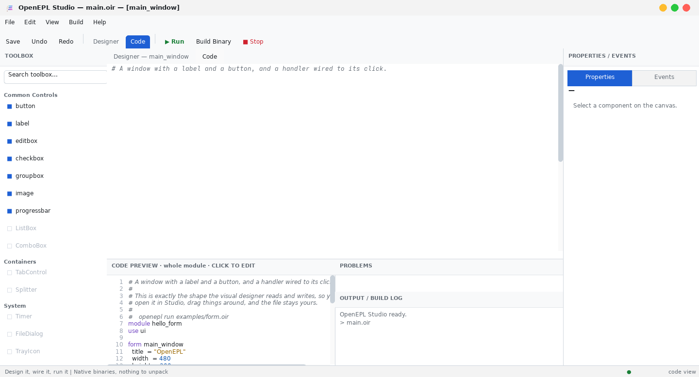

# The IDE

`openepl-studio` with no arguments opens the welcome screen; with a `.oir`
file it opens that project.


## The layout

- **Toolbox** — the components you can place, grouped by the section each kit
  declares. Search narrows it. A filled square is a control with a rectangle; a
  diamond is one without. Greyed items are declared but not implemented yet.
- **Canvas** — the form as it will look. Drag to move, drag the handles to
  resize, drag the form's corner to resize the window.
- **Tray** — the strip under the canvas, holding the components that have no
  pixels. Click one to select it.
- **Inspector** — every property of the selection, and its events on the
  second tab. Type a value and press Enter.
- **Code preview** — the source for whatever is selected. Click it to open the
  editor.
- **Problems** — what the language server has found, updated as you type.
- **Output** — build progress and whatever your program prints.

The panels are resizable: drag the dividers between them.

## The toolbox is what the toolchain reports

Studio asks `openepl kits` which kits are installed and `openepl commands`
what each one declares, every time it starts. Nothing about the palette is
compiled into the IDE, so a kit dropped into `kits/` beside your project — or
installed with `openepl kit add` — shows up in the toolbox with no new version
of Studio. The heading it files under is the `section` in the kit's `lib.json`.

## Property editors

The kind of editor a property gets comes from the component's own metadata,
not from the property's name:

| Declared editor | What the inspector offers |
|---|---|
| `color` | a swatch showing the current colour; click it for a palette |
| `file` | a **Browse…** button listing the files beside your project |
| `multiline` | a box several lines tall, for text with newlines in it |
| *(none)* | a one-line field |

A colour swatch with a dashed outline means the property is unset — the
default applies, and nothing is written to your file until you choose.

## Components without pixels

A `timer` has an interval and a `tick` event. An `action` has a caption and a
shortcut. An `httpserver` has a port. None of them has a rectangle, so none of
them can go on the form: they are declared beside it, at module level, and the
compiler rejects a form that tries to hold one.

Studio puts them in the tray under the canvas instead. Drop one from the
toolbox's **System** section and it is written after the form rather than
inside it; select it in the tray to edit its properties and wire its events
exactly as you would a button's.

A component from a kit also needs that kit in scope. Studio says so in the
output pane rather than writing a `use` line you did not ask for — add it in
the Code view.

> Components already declared in a file are not listed in the tray yet:
> `openepl inspect`, which is Studio's only reader of a project, reports forms
> and their children and nothing else. They are still in the file, still
> compiled, and a save leaves them alone.

## Designer and Code

The two tabs are two views of one file. Anything you do in the designer is
written to the source, and anything you write is read back by the designer.



The editor has syntax highlighting and live diagnostics from the same language
server other editors use. **Ctrl+S** saves. Saving from the editor re-reads
the file, so the canvas follows what you wrote.

Code that does not parse is still saved — the error appears in Problems rather
than blocking you. Losing what you typed because it is not finished yet would
be worse than a stale canvas.

## Running

**Run** builds the project and starts it. **Build Binary** builds without
running. **Stop** ends a running program.

The console shows the exact command, the stages of the build, every line the
compiler emits, how long it took, and the size of the result — then your
program's own output, and its exit code.

```text
> openepl build my-app/main.oir -o /tmp/openepl_studio_app
  stage 1/4  parse + validate .oir
  stage 2/4  lower to LLVM IR
  stage 3/4  clang: assemble + link the runtime
  stage 4/4  dead-strip unused commands
OK  /tmp/openepl_studio_app — 24101 KB in 5.16s
> running: /tmp/openepl_studio_app  (pid 12345)
  output below is the program's own stdout/stderr
Hello from OpenEPL.
> app exited with code 0
```

A console program has no window: it runs, prints into that pane, and finishes.

## Undo

**Ctrl+Z** and **Ctrl+Shift+Z**, or the toolbar buttons. Designer edits —
adding, moving, resizing, deleting, property changes — are undoable.

## Where projects go

Projects created from the welcome screen are made in the directory Studio was
started from. Start it where you keep your work:

```sh
cd ~/projects && openepl-studio
```
