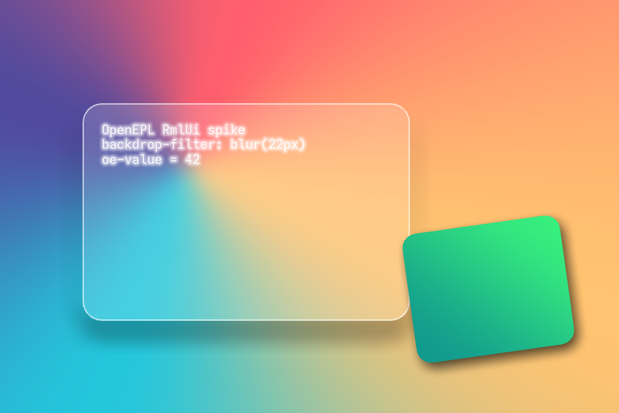

# Q9 spike results — RmlUi

**Run:** 2026-08-30 · **Verdict: PASS on all four steps — RmlUi is confirmed viable.**
Executes ADR 0004 §8. Reproduce with `./build.sh`.

Environment: Fedora 43, clang 21.1.8, RmlUi **6.3** (MIT), SDL2 2.32 + SDL2_image,
FreeType 2.13.3, GL 4.6 (NVIDIA), Wayland.

---

## Step 1 — do the effects actually render? ✅ PASS (visually verified)

Verified rendering through the **unmodified reference GL3 backend**:
conic-gradient · linear-gradient · **`backdrop-filter: blur(22px)`** (the card's
interior is visibly blurred relative to the background — real glassmorphism) ·
`filter: drop-shadow(...)` · `box-shadow` · `border-radius` ·
`transform: rotate(-8deg) scale(1.05)` · `font-effect: glow(...)` · translucency.

**This is FMX-class output**, produced without modifying the backend.

### 🔴 Critical finding: decorators silently no-op without a stylesheet

The first run **passed every assertion while rendering nothing** — gradients and
an entire card were missing, but `SetProperty` returned `true` and a
"wide tonal range" heuristic went green. Isolated in `paint.cpp`:

| Element property, set inline at runtime | Painted? |
|---|---|
| `background-color: #e04040` | ✅ `224,64,64` |
| `decorator: linear-gradient(...)` | ❌ `32,32,32` (= body background) |
| `decorator: conic-gradient(...)` | ❌ `32,32,32` |
| `decorator: horizontal-gradient(...)` | ❌ `32,32,32` |

**Cause** (confirmed in `sheet.cpp`): a document created with bare
`Context::CreateDocument()` has **no stylesheet context**, and decorators are
silently dropped. With a minimal stylesheet seeded via
`LoadDocumentFromMemory`, a decorator **set inline at runtime** paints
identically to one applied by a CSS class (`36,196,133` both).

**Consequence for OpenEPL:** the runtime must instantiate forms into a
stylesheet-seeded document, never a bare one. Cheap to satisfy — we generate
RCSS from the designer anyway — but it would have been a baffling bug to hit
later, and it validates the research warning that *"if a feature isn't
supported it silently does nothing."*

**Testing lesson:** pixel-statistics heuristics are not proof. Only asserting a
specific pixel against a specific expected colour caught this.

Minor: the `transition` shorthand was **rejected** (`transition: background-color
0.3s ease-in-out`) — RCSS syntax differs from CSS here. `animation` parsed fine.

## Step 2 — the component model (LibInfo analogue) ✅ PASS

All 11 assertions pass. Everything below is done **at runtime, by string name**,
with the UI built programmatically — the mode the OpenEPL runtime would use when
instantiating a form from IR:

- `StyleSheetSpecification::RegisterProperty("oe-value", ...)` — **our own custom
  property**, registered by name.
- `Factory::RegisterElementInstancer("oe-gauge", ...)` — **our own component
  type** under **our own tag name**; `CreateElement("oe-gauge")` returns our
  C++ class (verified by `dynamic_cast`).
- `SetProperty` by string for 14 properties spanning colour, length, shadow,
  filter, and our custom property.
- `GetProperty("oe-value")` reads back `42`.
- `AddEventListener("click", ...)` by string; a dispatched event reaches our
  listener with the correct target id.

**This is the direct analogue of `LibInfo` component registration** and it works.

## Step 3 — binary size ✅ PASS (best in class)

| Toolkit | Stripped hello-world |
|---|---|
| **RmlUi 6.3** (static; SDL2/FreeType/GL dynamic) | **2,576 KiB** |
| egui/eframe 0.32.3 | 6,113 KiB |
| iced 0.14.0 | 8,610 KiB |

**2.4–3.3× smaller than the Rust toolkits.** Caveat: 46 shared-library deps, but
inflated by **SDL2_image** pulling in jxl/tiff/avif/webp codecs we do not need —
a purpose-built backend drops those. RmlUi itself builds in ~1 minute (203 targets).

## Step 4 — accessibility reachable? ✅ PASS (reachable, not free)

RmlUi ships **no accessibility**, as expected. But a bridge is architecturally
straightforward — it exposes everything an a11y tree needs:
`GetTagName`, `GetId`, `GetNumChildren`/`GetChild`, `GetParentNode`,
`GetAbsoluteOffset`, `GetBox`, `GetAttribute`, `GetInnerRML`, `Focus`/`Blur`, and
a maintained `:focus` pseudo-class. **AccessKit 0.25.0** exists with C bindings
(`accesskit-c`), covering UI Automation / NSAccessibility / AT-SPI.

Bridge design: walk the element tree → map tag to role, id/text to name,
absolute offset + box to bounds, `:focus` to focus state → push to AccessKit.
Real work, but **no blocker**. Must be built in from day one (ADR 0004 D12).

---

## Verdict

**All four kill-risks cleared.** RmlUi delivers FMX-class visuals through an
unmodified reference backend, natively supports the string-keyed component model
our `LibInfo` ABI needs, produces the smallest binaries of any candidate
measured, and leaves accessibility reachable.

**Recommend adopting RmlUi** as the widget substrate behind the D10 backend
interface, with these carried forward as known work:
1. Always seed a stylesheet (Step 1 finding) — cheap.
2. C shim over the C++ API — bounded; the surface exercised here is the surface.
3. HarfBuzz via `FontEngineInterface` for complex scripts — still unaddressed.
4. AccessKit bridge — design in from the start.
5. Replace the SDL2_image-based backend to shed unnecessary codec deps.

**Not tested here:** HarfBuzz integration, arm64, macOS/Windows, animation
smoothness under load, and the 500+ control scaling that afflicts FMX.
